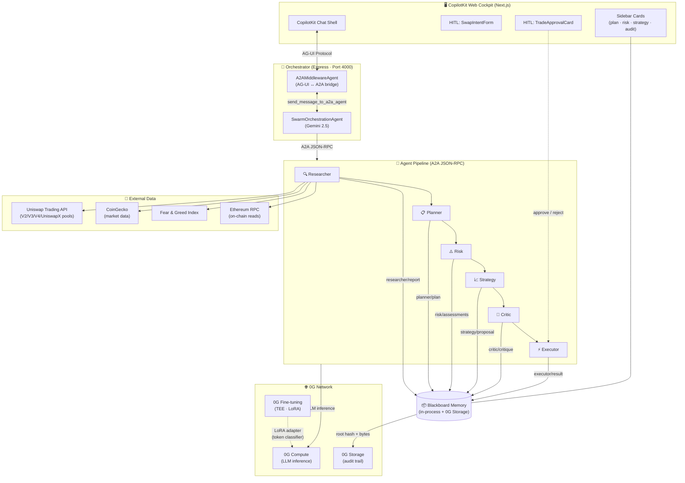
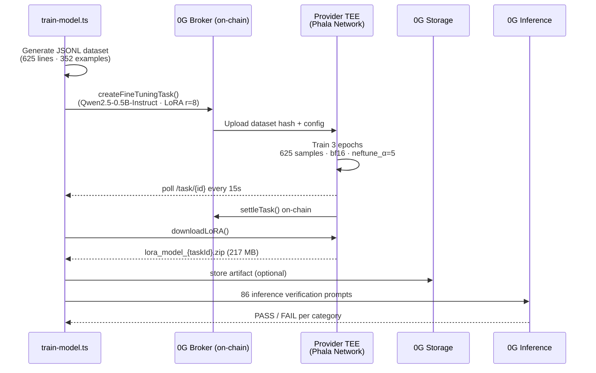

# UniswapSwarm

An autonomous AI agent swarm that identifies and executes profitable, low-risk token swaps across **Uniswap V2/V3/V4 and UniswapX** (Ethereum mainnet). Built on top of the **0G Compute Network** for verifiable, decentralised LLM inference and **0G Storage** for on-chain audit trails, with a **CopilotKit + AG-UI / A2A** front-end for live, multi-agent observability and HITL approval.

> **Capital preservation first.** The swarm is tuned to prioritise safety over yield — every trade is researched, planned, risk-scored, strategised, and critiqued before execution. Stablecoin-to-stablecoin swaps (USDC ↔ USDT, DAI ↔ USDC, …) are categorically forbidden by policy at three independent layers.

---

## Architecture

The swarm runs a sequential pipeline of specialised agents that share a common **Blackboard Memory** per cycle. Each agent writes its output to in-process memory that is simultaneously persisted to **0G Storage** as an immutable, on-chain audit trail.



### Agent Roles

| Agent | Package | Role |
|-------|---------|------|
| **Researcher** | `agent-researcher` | Fetches live Uniswap pool data, CoinGecko market data, Fear & Greed index, Reddit/news narrative signal; detects market narrative (`ai \| safe_haven \| defi \| l2 \| staking \| neutral`); returns ranked `TokenCandidate` objects |
| **Planner** | `agent-planner` | Reads Researcher output and produces a structured `TradePlan` with strategy type, constraints, and tasks |
| **Risk** | `agent-risk` | Scores each candidate (honeypot, low liquidity, MEV risk, …) and flags unsafe tokens |
| **Strategy** | `agent-strategy` | Selects the best trade route, sizes the position, and sets slippage/fee parameters |
| **Critic** | `agent-critic` | Reviews the fully assembled plan and approves or rejects it with a confidence score |
| **Executor** | `agent-executor` | Submits the swap via Uniswap's `SwapRouter02` (supports dry-run and simulation-only modes) |

All LLM calls go through `@swarm/compute` (`ZGCompute`) — a thin wrapper around the [0G Serving Broker](https://github.com/0glabs/0g-serving-broker) that auto-manages ledger deposits and provider acknowledgement.

All agent outputs are persisted via `@swarm/memory` (`ZGStorage`) to the [0G Storage network](https://docs.0g.ai) for cross-cycle auditability.

### 0G Fine-tuning Pipeline

The `scripts/train-model.ts` script trains a **token classifier LoRA** on the 0G Compute Network's Trusted Execution Environment (TEE). The trained adapter teaches the swarm's inference layer to precisely categorise tokens into `L1 | L2 | Stable | DeFi | RWA | AI` — improving Researcher candidate selection accuracy.



**Training results (task `dfe58ce0`):**
- Model: `Qwen2.5-0.5B-Instruct` · LoRA rank=8, alpha=32, dropout=0.1
- Dataset: 625 JSONL lines (352 unique examples + 154 address-based pairs)
- 3 epochs · 237 steps · 209s · train_loss 6.834 → **0.4386** (final epoch step: 0.09)
- Artifact: `output/token-classifier/lora_model_dfe58ce0-f703-40b4-a3e3-67595ffb60a0.zip`

---

## Monorepo Structure

```
uniswapswarm/
├── apps/
│   ├── orchestrator/                 # Express REST server + cycle runner +
│   │   └── src/
│   │       ├── a2aAgents.ts          #   six standalone A2A JSON-RPC servers
│   │       ├── a2aOrchestrator.ts    #   AG-UI orchestrator wiring
│   │       ├── orchestrator.ts       #   sequential pipeline runner
│   │       └── server.ts             #   REST + SSE endpoints
│   └── web/                          # Next.js + CopilotKit cockpit
│       ├── app/                      #   App Router pages + /api/copilotkit
│       ├── components/
│       │   ├── a2a/                  #     animated MessageToA2A / FromA2A cards
│       │   ├── data/                 #     sidebar cards (plan, risk, strategy, audit)
│       │   ├── forms/                #     HITL: SwapIntentForm
│       │   ├── hitl/                 #     HITL: TradeApprovalCard
│       │   ├── swarm-audit-context.tsx  #   0G storage write fan-in
│       │   └── swarm-chat.tsx        #     CopilotKit actions + chat shell
│       └── lib/                      #   wallet watch, SSE plumbing, agent registry
├── agents/
│   ├── agent-researcher/   # Uniswap pool data, CoinGecko, Fear&Greed, narrative detection,
│   │   └── src/            #   goal-focused token feed, simplified run() + buildTokenFeed()
│   ├── agent-planner/
│   ├── agent-risk/
│   ├── agent-strategy/
│   ├── agent-critic/
│   └── agent-executor/
├── packages/
│   ├── compute/            # ZGCompute — 0G Compute client + fine-tune task management
│   ├── memory/             # BlackboardMemory + ZGStorage — shared state & on-chain audit
│   ├── shared/             # Config (Zod), types, logger, token classifier constants,
│   │                       #   stablecoin set, PROVIDER_ADDRESS, FINE_TUNE_MODEL
│   ├── eslint-config/
│   └── typescript-config/
├── scripts/
│   ├── train-model.ts      # 0G fine-tuning pipeline: dataset gen → TEE train → LoRA download → verify
│   ├── check-model.ts      # Quick inference smoke-test against a running 0G provider
│   ├── fund-ledger.ts      # Fund / top-up the 0G Compute ledger
│   ├── create-dynamo-tables.ts  # Provision DynamoDB history + wallet tables
│   └── README.md           # Script-level documentation
└── output/
    └── token-classifier/   # Downloaded LoRA artifacts (.zip) + .last-fine-tune-task-id
```

Built with [Turborepo](https://turbo.build/) and [pnpm workspaces](https://pnpm.io/workspaces).

---

## Prerequisites

| Tool                  | Version                                                                            |
| --------------------- | ---------------------------------------------------------------------------------- |
| Node.js               | ≥ 18                                                                               |
| pnpm                  | ≥ 9                                                                                |
| A funded 0G wallet    | See [0G docs](https://docs.0g.ai)                                                  |
| Google Gemini API key | For the cockpit orchestrator. [Get a key](https://aistudio.google.com/app/apikey). |

---

## Setup

### 1. Clone and install

```sh
git clone git@github.com:NirajBhattarai/UniswapSwarm.git
cd UniswapSwarm
pnpm install
```

### 2. Configure environment

Copy the example and fill in your keys:

```sh
cp .env.example .env
```

| Variable                    | Required | Description                                                                           |
| --------------------------- | -------- | ------------------------------------------------------------------------------------- |
| `ZG_PRIVATE_KEY`            | **yes**  | Private key of a funded 0G wallet (64-char hex, no `0x`)                              |
| `ZG_CHAIN_RPC`              | no       | 0G EVM RPC (default: `https://evmrpc-testnet.0g.ai`)                                  |
| `ETH_RPC_URL`               | no       | Ethereum mainnet RPC (default: `https://eth.llamarpc.com`)                            |
| `ZG_COMPUTE_RPC`            | no       | 0G Compute indexer RPC (default: `https://indexer-storage-testnet-turbo.0g.ai`)       |
| `ZG_STORAGE_RPC`            | no       | 0G Storage RPC (default: `https://evmrpc-testnet.0g.ai`)                              |
| `ZG_INDEXER_RPC`            | no       | 0G Storage indexer RPC (default: `https://indexer-storage-testnet-turbo.0g.ai`)       |
| `ZG_FLOW_CONTRACT`          | no       | 0G Flow contract address (default: `0xbD2C3F0E65eDF5582141C35969d66e205E00C9c8`)      |
| `UNISWAP_API_KEY`           | no       | Uniswap Trading API key (https://developers.uniswap.org/dashboard)                    |
| `COINGECKO_API_KEY`         | no       | CoinGecko API key — free demo key or pro key (https://www.coingecko.com/en/api)       |
| `ALCHEMY_API_KEY`           | no       | Enables full ERC-20 wallet holdings discovery (fallback is known-token Multicall)     |
| `MAX_SLIPPAGE_PCT`          | no       | Maximum swap slippage % (default: `1.5`)                                              |
| `MAX_POSITION_USDC`         | no       | Maximum position size in USDC (default: `50`)                                         |
| `MIN_LIQUIDITY_USD`         | no       | Minimum pool liquidity required (default: `100000`)                                   |
| `MAX_GAS_GWEI`              | no       | Gas price ceiling in Gwei (default: `30`)                                             |
| `RISK_SCORE_THRESHOLD`      | no       | Minimum risk score to proceed (0–100, default: `70`)                                  |
| `DRY_RUN`                   | no       | `true` to simulate swaps without submitting on-chain (default: `true`)                |
| `SIMULATION_ONLY`           | no       | Extra execution guard. If `true`, forces simulation even when `DRY_RUN=false`         |
| `CYCLE_INTERVAL_MS`         | no       | Milliseconds between autonomous cycles (default: `300000` = 5 min)                    |
| `PORT`                      | no       | REST server port (default: `4000`)                                                    |
| `DYNAMODB_REGION`           | no       | AWS region for optional history persistence (e.g. `us-east-1`)                        |
| `DYNAMODB_HISTORY_TABLE`    | no       | DynamoDB table name for persisted session/cycle history                               |
| `DYNAMODB_HISTORY_GSI_USER` | no       | User-index GSI name for history queries (default: `GSI1`)                             |
| `AWS_ACCESS_KEY_ID`         | no       | AWS access key ID used by Dynamo history client (optional; IAM role/chain also works) |
| `AWS_SECRET_ACCESS_KEY`     | no       | AWS secret access key paired with `AWS_ACCESS_KEY_ID`                                 |
| `AWS_SESSION_TOKEN`         | no       | AWS session token for temporary credentials (optional)                                |

#### Fine-tuning (`scripts/train-model.ts`)

| Variable        | Description                                                    |
| --------------- | -------------------------------------------------------------- |
| `ZG_PRIVATE_KEY`| Same key used for inference — covers the fine-tune sub-account |
| `ZG_CHAIN_RPC`  | 0G EVM RPC (testnet only — fine-tuning is testnet-only)        |

#### CopilotKit cockpit / A2A integration

| Variable                             | Required        | Description                                                                                               |
| ------------------------------------ | --------------- | --------------------------------------------------------------------------------------------------------- |
| `GOOGLE_GENERATIVE_AI_API_KEY`       | **for web app** | Gemini API key. Aliases `GOOGLE_API_KEY` and `GEMINI_API_KEY` are also accepted as fallbacks.             |
| `COPILOTKIT_MODEL`                   | no              | Gemini model used by the orchestrator (default: `gemini-2.5-flash`).                                      |
| `NEXT_PUBLIC_COPILOTKIT_RUNTIME_URL` | no              | Frontend → CopilotKit runtime URL (default: `/api/copilotkit`).                                           |
| `NEXT_PUBLIC_ORCHESTRATOR_URL`       | no              | Frontend → orchestrator REST/A2A base URL (default: `http://localhost:4000`).                             |
| `NEXT_PUBLIC_REOWN_PROJECT_ID`       | no              | Reown AppKit project ID for wallet connect/signature flows in the web UI.                                 |
| `A2A_PUBLIC_BASE_URL`                | no              | Public URL embedded in agent cards. Defaults to `http://localhost:${PORT}`.                               |
| `ORCHESTRATOR_URL`                   | no              | Base URL for A2A agent endpoints (default: `http://localhost:4000`). All agents are accessible as routes. |
| `RESEARCHER_AGENT_URL`, etc.         | no              | Per-agent URL overrides for the web app. Defaults to `${ORCHESTRATOR_URL}/a2a/agents/<agent-id>`.         |

### 3. Fund the 0G Compute ledger

Before first use, top up your 0G Compute ledger (target: 5 OG, keeps 1 OG reserve in wallet):

```sh
pnpm tsx scripts/fund-ledger.ts
```

### 4. (Optional) Train the token classifier

Fine-tune a `Qwen2.5-0.5B-Instruct` LoRA on 0G's TEE to improve Researcher token categorisation:

```sh
# Full pipeline — generate dataset, submit TEE task, download LoRA, run verification
npx tsx scripts/train-model.ts

# Resume an existing completed task (skip training, just download + verify)
npx tsx scripts/train-model.ts --skip-train --task-id <uuid>
```

See [`scripts/README.md`](./scripts/README.md) for full usage and options.

### 5. Build

```sh
pnpm build
```

---

## Running

### REST server (recommended)

```sh
pnpm --filter orchestrator start
```

The server starts on port `4000` by default (override with `PORT` env var).

#### Full-pipeline endpoints

| Method | Path                | Description                                               |
| ------ | ------------------- | --------------------------------------------------------- |
| `GET`  | `/health`           | Liveness check (`{ status, running }`)                    |
| `POST` | `/a2a/route/stream` | Run intent-routed agent pipeline with SSE event streaming |

#### Per-agent endpoints

Each agent can also be invoked individually. All support both a blocking JSON form and a Server-Sent Events stream form.

| Method | Path                               | Body                   | Description                                   |
| ------ | ---------------------------------- | ---------------------- | --------------------------------------------- |
| `POST` | `/agents/researcher`               | `{ goal?: string }`    | Run Researcher agent (JSON)                   |
| `POST` | `/agents/researcher/stream`        | `{ goal?: string }`    | Run Researcher agent (SSE)                    |
| `POST` | `/agents/researcher/prices`        | `{ tokens: string[] }` | Fetch live prices for a list of token symbols |
| `POST` | `/agents/researcher/prices/stream` | `{ tokens: string[] }` | Same, as SSE                                  |
| `POST` | `/agents/researcher/market`        | `{ tokens: string[] }` | Fetch CoinGecko 24h market data               |
| `POST` | `/agents/planner`                  | `{ goal?: string }`    | Run Planner agent (JSON)                      |
| `POST` | `/agents/planner/stream`           | `{ goal?: string }`    | Run Planner agent (SSE)                       |
| `POST` | `/agents/risk`                     | —                      | Run Risk agent (reads memory)                 |
| `POST` | `/agents/risk/stream`              | —                      | Run Risk agent (SSE)                          |
| `POST` | `/agents/strategy`                 | —                      | Run Strategy agent (reads memory)             |
| `POST` | `/agents/strategy/stream`          | —                      | Run Strategy agent (SSE)                      |
| `POST` | `/agents/critic`                   | —                      | Run Critic agent (reads memory)               |
| `POST` | `/agents/critic/stream`            | —                      | Run Critic agent (SSE)                        |
| `POST` | `/agents/executor`                 | —                      | Run Executor agent (reads memory)             |
| `POST` | `/agents/executor/stream`          | —                      | Run Executor agent (SSE)                      |

#### State endpoints

| Method | Path       | Description                                                                 |
| ------ | ---------- | --------------------------------------------------------------------------- |
| `GET`  | `/memory`  | Dump blackboard memory (`?sessionId=...` to scope, no query = all sessions) |
| `GET`  | `/history` | Cycle history currently held in orchestrator process memory                 |
| `GET`  | `/latest`  | Most recent completed cycle state                                           |

### Orchestrator dev server (CLI)

```sh
pnpm --filter @swarm/orchestrator dev
```

### CopilotKit A2A web cockpit

The `apps/web` Next.js app implements the same multi-agent UI pattern as
[CopilotKit/a2a-travel](https://github.com/CopilotKit/a2a-travel), but tailored to
the Uniswap swap pipeline. Each Uniswap Swarm agent is exposed as its own
A2A JSON-RPC server, and a `A2AMiddlewareAgent` wraps a Gemini-backed
orchestration agent and auto-injects the `send_message_to_a2a_agent` tools.

```
apps/web (CopilotKit + AG-UI)
   │
   │  AG-UI Protocol (in-process)
   ▼
SwarmOrchestrationAgent (Gemini)
   │
   │  send_message_to_a2a_agent tool (injected by A2AMiddlewareAgent)
   ▼
┌──────────────┬────────────┬──────────────┬──────────────┬────────────┬──────────────┐
│ Researcher   │ Planner    │ Risk         │ Strategy     │ Critic     │ Executor     │
│ Port 4000    │ Port 4000  │ Port 4000    │ Port 4000    │ Port 4000  │ Port 4000    │
│ /a2a/agents/ │ /a2a/      │ /a2a/agents/ │ /a2a/agents/ │ /a2a/      │ /a2a/agents/ │
│ researcher   │ agents/    │ risk         │ strategy     │ agents/    │ executor     │
│              │ planner    │              │              │ critic     │              │
└──────────────┴────────────┴──────────────┴──────────────┴────────────┴──────────────┘
       (all agents run on same port with route-based A2A JSON-RPC endpoints)
```

```sh
# Run orchestrator + 6 A2A agent servers + Next.js web UI in parallel
pnpm dev
```

Then open http://localhost:3000.

#### What you see in the UI

- **Animated A2A handoff cards.** Every `send_message_to_a2a_agent` call
  renders as a green "orchestrator → agent" card with a flowing arrow,
  pulsing badge, and bouncing ellipsis while the request is in flight,
  followed by a blue "agent → orchestrator" response card sliding in from
  the right when complete.
- **0G Storage audit chips.** Each response card lists the keys the agent
  wrote to 0G Storage along with truncated root hashes and byte sizes
  (`risk/assessments → 0x8ad6…ba6d3 · 943 B`). The same data is aggregated
  into a dedicated **Storage Audit Trail** card in the sidebar, fed via a
  `SwarmAuditContext` that fan-ins writes from every streamed message.
- **Sidebar data cards.** Structured JSON from each agent is parsed and
  rendered as first-class cards: candidate list, plan tasks, per-token
  risk score with severity-ranked flags, strategy proposal (route, fee
  tier, slippage), critic verdict, and execution receipt.
- **Defensive task rendering.** If the orchestrator LLM regresses and
  pastes a previous agent's JSON envelope into the next `task`, the UI
  detects the JSON shape and renders a compact "📎 Forwarded payload"
  pill instead of dumping braces into the chat.
- **Two HITL flows** mirroring the a2a-travel trip-requirements / budget
  approval pattern:
  - `gather_swap_intent` — pre-trade form (token-in, token-out, USD size,
    risk level). Used **rarely** — only when the user opens the chat with
    a bare greeting. Any actionable prompt ("find safe trades", "swap X
    for Y") goes straight to the Researcher.
  - `request_trade_approval` — post-critic approval card. The Executor
    will not sign without an explicit user click here.

Required environment variables (see `.env.example`):

```env
GOOGLE_GENERATIVE_AI_API_KEY=...   # or GOOGLE_API_KEY / GEMINI_API_KEY
COPILOTKIT_MODEL=gemini-2.5-flash
# All agents run on port 4000 with route-based endpoints
# ORCHESTRATOR_URL=http://localhost:4000  # optional override
```

---

## How a Cycle Works

Every agent writes its output to the shared `BlackboardMemory`. Each write is simultaneously uploaded to **0G Storage** as an immutable root hash, forming an on-chain audit trail. Every downstream agent reads prior outputs from that same memory via `memory.contextFor()`.

1. **Researcher** — refactored to a single `run()` + `buildTokenFeed()` flow:
   - Detects the current market narrative (`ai | safe_haven | defi | l2 | staking | neutral`) from Fear & Greed index and Reddit/news headlines via `impit`
   - Fetches CoinGecko 24h market data for wallet tokens + narrative-focused candidates
   - Fetches live multi-protocol Uniswap pool snapshots (V2/V3/V4/UniswapX) for each candidate
   - Applies **goal-first generic rules** in the system prompt (replaced hardcoded per-narrative token lists with dynamic focus based on the user's stated goal)
   - Writes `researcher/report` to shared memory

2. **Planner** reads `researcher/report` from memory and produces a `TradePlan` (strategy type, conservative constraints, per-agent task list), writing `planner/plan`.

3. **Risk Agent** reads `planner/plan` + `researcher/report` and runs each candidate through honeypot detection, ownership concentration checks, MEV exposure scoring, and more — writing `risk/assessments`.

4. **Strategy Agent** reads all prior memory, picks the highest-scoring safe candidate, and crafts an exact swap calldata spec (`TradeStrategy`), writing `strategy/proposal`.

5. **Critic Agent** reads all memory entries, performs a holistic review, and either approves or rejects with a confidence score + issues list — writing `critic/critique`.

6. **Executor** — if the Critic approved — executes through Uniswap Trading API (`check_approval` → `quote` → `swap`). Runtime safety defaults to simulation because `DRY_RUN=true` by default. The optional `SIMULATION_ONLY` guard can additionally force simulation regardless of `DRY_RUN`.

---

## Blackboard Memory Keys

| Key                 | Written by | Content                       |
| ------------------- | ---------- | ----------------------------- |
| `researcher/report` | Researcher | `ResearchReport` (candidates) |
| `planner/plan`      | Planner    | `TradePlan`                   |
| `risk/assessments`  | Risk       | `RiskAssessment[]`            |
| `strategy/proposal` | Strategy   | `TradeStrategy`               |
| `critic/critique`   | Critic     | `Critique`                    |
| `executor/result`   | Executor   | `ExecutionResult`             |

---

## Safety Policies

### Stablecoin → stablecoin swaps are forbidden

The trade always starts from a USD-pegged token (typically USDC), so a
stable `tokenOut` (USDT, DAI, FRAX, BUSD, FDUSD, PYUSD, USDe, USDS, …) is
a 1:1 swap with no economic upside that only burns gas and slippage. The
swarm enforces this at **three independent layers** so that even a buggy
LLM completion cannot produce one:

| Layer      | Where                                                                          | Behaviour                                                                                                                                                               |
| ---------- | ------------------------------------------------------------------------------ | ----------------------------------------------------------------------------------------------------------------------------------------------------------------------- |
| Researcher | `agents/agent-researcher/src/core/prompts.ts` + `formatters/researchPrompt.ts` | System prompt forbids stablecoin candidates, post-LLM filter drops anything `isStablecoin({symbol, address})` returns true for.                                         |
| Strategy   | `agents/agent-strategy/src/StrategyAgent.ts`                                   | Stablecoins are stripped from the candidate pool before the LLM sees it; if the LLM still emits a stable `tokenOut`, the agent forces the synthetic USDC→WETH fallback. |
| Critic     | `agents/agent-critic/src/CriticAgent.ts`                                       | Hard veto: any proposal where both `tokenIn` and `tokenOut` are stablecoins is rejected with confidence=100.                                                            |

The canonical stablecoin set lives in
[`packages/shared/src/constants.ts`](./packages/shared/src/constants.ts)
and is exposed as `STABLECOIN_SYMBOLS`, `STABLECOIN_ADDRESSES`, and
`isStablecoin({ symbol, address })`.

### Other built-in safeguards

- `maxSlippagePct` is hard-clamped after LLM inference; the LLM cannot exceed the configured plan ceiling.
- The Risk Agent emits typed `RiskFlag[]` with severity (`low | medium | high | critical`); any `critical` flag forces a Critic rejection.
- The Executor checks both `DRY_RUN` and `SIMULATION_ONLY`; any true value keeps execution in simulation mode.

---

## Recent Changes

### ResearchAgent refactor

- `run()` simplified — removed 4 dead methods, extracted `buildTokenFeed()` for cleaner narrative-driven candidate assembly
- `core/prompts.ts` — system prompt now uses **goal-first generic rules** instead of hardcoded per-narrative token lists; the active user goal is injected at call time
- `services/index.ts` — removed stale `fetchGoalFocusSymbols` export
- `services/coinGeckoMarket.ts` — updated market data fetch to align with new token feed structure
- `services/poolSnapshots.ts` — fixed edge-case handling for missing pool data

### ZGCompute (`packages/compute`)

- Added `createFineTuningTask()`, `pollFineTuningTask()`, `acknowledgeFineTuneModel()`, and `downloadLoRA()` methods
- Handles `CannotAcknowledgeSettledDeliverable` gracefully — detects already-settled tasks and skips re-acknowledgement without crashing

### Shared package (`packages/shared`)

- `constants.ts` — added `TOKEN_CLASSIFIER_CATEGORIES`, `FINE_TUNE_MODEL`, `PROVIDER_ADDRESS`, and category-to-token mappings used by both the Researcher and the training script
- `config.ts` — added `ZG_CHAIN_RPC` and fine-tuning provider config fields

### Scripts

| Script | What's new |
|--------|------------|
| `train-model.ts` | Full 0G fine-tuning pipeline: JSONL dataset generation (625 lines, 352 examples, 154 address pairs), TEE task submission, 65s rate-limit retry logic, LoRA download, 86-prompt inference verification. Supports `--skip-train --task-id <uuid>` to resume completed tasks. |
| `check-model.ts` | Quick smoke-test: lists available 0G inference providers and runs a single classification prompt |
| `fund-ledger.ts` | Unchanged — top-up helper |

---

## Development

```sh
# Type-check all packages
pnpm check-types

# Format every TS / TSX / MD file with Prettier
pnpm format

# Lint
pnpm lint

# Build with watch (individual package)
pnpm --filter @swarm/compute dev

# Run orchestrator + 6 A2A servers + Next.js cockpit in parallel
pnpm dev
```

---

## Key Dependencies

### Runtime — agents & orchestrator

- [`@0glabs/0g-serving-broker`](https://www.npmjs.com/package/@0glabs/0g-serving-broker) — 0G Compute paymaster & inference client
- [`@0gfoundation/0g-ts-sdk`](https://www.npmjs.com/package/@0gfoundation/0g-ts-sdk) — 0G Storage SDK (file upload / root hash)
- [`ethers`](https://www.npmjs.com/package/ethers) v6 — Ethereum wallet & provider
- [`impit`](https://www.npmjs.com/package/impit) — TLS-fingerprint spoofer for bot-detection bypass (Fear & Greed, Reddit)
- [`zod`](https://www.npmjs.com/package/zod) — Runtime config & env validation
- [`express`](https://www.npmjs.com/package/express) — REST API server
- [`uuid`](https://www.npmjs.com/package/uuid) — Cycle ID generation

### Cockpit — `apps/web`

- [`@copilotkit/react-core`](https://www.npmjs.com/package/@copilotkit/react-core) + [`@copilotkit/react-ui`](https://www.npmjs.com/package/@copilotkit/react-ui) — chat shell, tool actions, HITL renderers
- [`@copilotkit/runtime`](https://www.npmjs.com/package/@copilotkit/runtime) — Next.js API route adapter
- [`@ag-ui/a2a-middleware`](https://www.npmjs.com/package/@ag-ui/a2a-middleware) — bridges AG-UI tool calls to A2A JSON-RPC
- [`@ai-sdk/google`](https://www.npmjs.com/package/@ai-sdk/google) — Gemini provider for the orchestrator
- [`next`](https://www.npmjs.com/package/next) 16 + [`react`](https://www.npmjs.com/package/react) 19 + [`tailwindcss`](https://www.npmjs.com/package/tailwindcss) v4

---

## License

MIT
